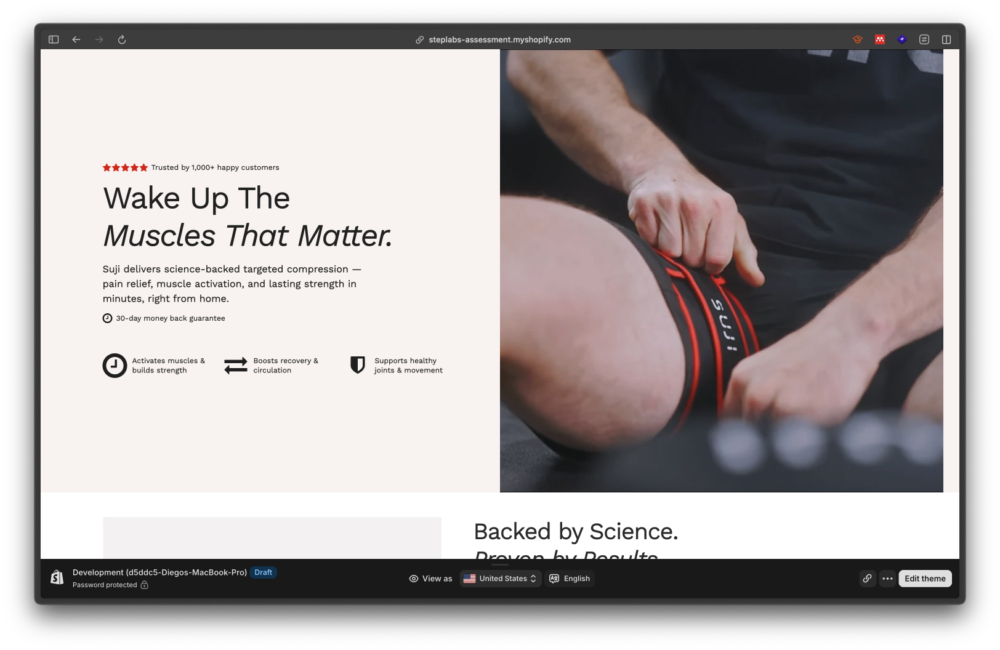
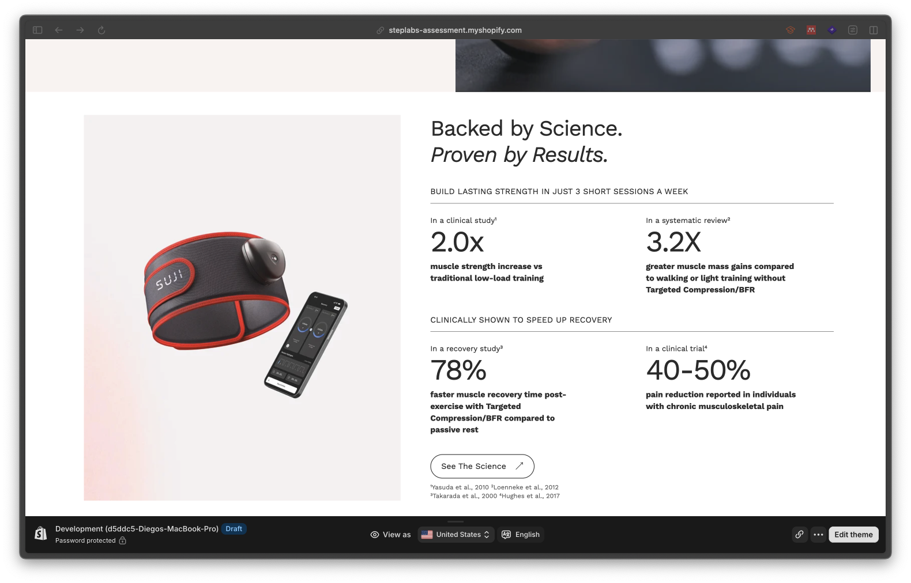

# StepLabs - Shopify Developer Assessment - Diego Quiros

A Shopify theme assessment built from the [Shopify Skeleton Theme](https://github.com/Shopify/skeleton-theme), with two custom Liquid sections authored by Diego Quiros.

## Author

Diego Quiros

## Custom sections

- [`sections/suji-hero.liquid`](sections/suji-hero.liquid) — Configurable Suji hero section with trust messaging, heading, description, calls to action, guarantee & benefit blocks.
- [`sections/suji-science-results.liquid`](sections/suji-science-results.liquid) — Science/results section with product imagery, grouped strength and recovery metrics, source notes, and a supporting link.

## Screenshots

Both screenshots show the theme in Shopify's desktop preview:

### Hero and storefront overview

### Science and results section

